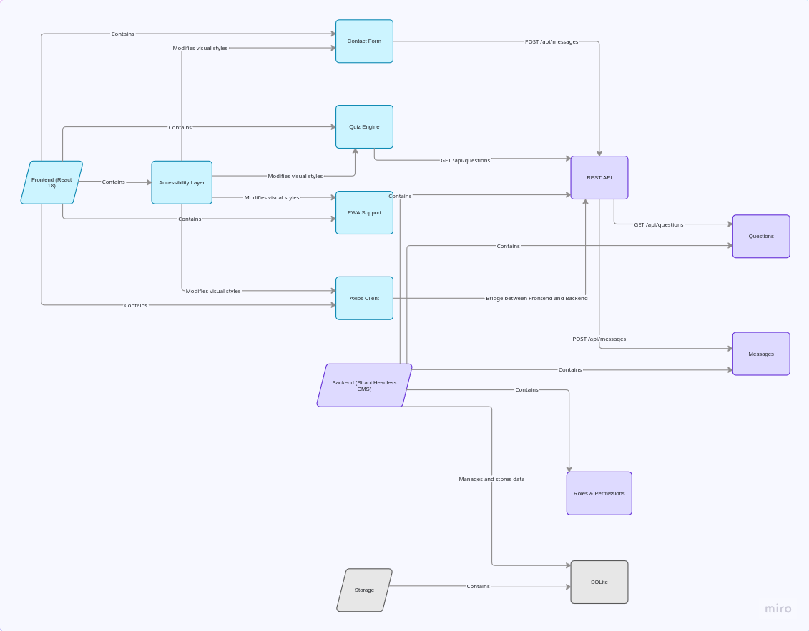

# QUIZZY App

A vibrant, modern general knowledge quiz built with **React**, **Vite**, and **JavaScript**. This project was developed with a strict focus on **clean code**, **Service Pattern architecture**, and **separation of concerns**.

## ✨ Key Features (New & Improved)

- **Service Layer Architecture**: Complete decoupling of API logic from UI components. All communication with the Strapi backend is centralized in a dedicated service layer.
- **User Authentication**: Secure registration and login system integrated with Strapi's Auth provider.
- **Internal Routing System**: Custom state-based navigation allowing seamless transitions between the Game, Contact, and Legal pages without page reloads.
- **Dynamic Database**: Fetches questions based on difficulty levels with a custom **Shuffle & Mapping** algorithm.
- **Inclusive Design (Dyslexic Mode)**: A specialized accessibility toggle that adjusts typography and spacing across the entire application.
- **Persistent Leaderboard**: Global "Hall of Fame" fetching the Top 5 scores in real-time.
- **Real-time Feedback**: Système de formulaire de contact asynchrone utilisant Axios pour envoyer des messages directement en base de données Strapi.

## ⚖️ Navigation & Compliance

- **GDPR Ready**: Integrated specialized pages for **CGU** (Terms of Use) and **Legal Mentions** to ensure transparency and user data protection compliance.
- **Advanced Form Validation**: The Contact form features a **Regex-based validation** system to ensure data integrity (Email format and message length checks) before submission.
- **Professional Layout**: Implemented a **Full-width Sticky Footer** using advanced CSS (Flexbox & Negative Margins) to maintain a professional look across all screen sizes.
- **WCAG Compliant**: Full keyboard navigation (TAB/ENTER) and semantic HTML5 tags (`<footer>`, `<nav>`, `<main>`) for better accessibility.


## 🚀 Tech Stack

- **Frontend**: React (Advanced Hooks: `useState`, `useEffect`, `useCallback`)
- **Backend**: Strapi CMS (Headless CMS)
- **Architecture**: **Service Pattern** (Separation of Data and View)
- **Styling**: CSS3 (Variables, Flexbox, Transitions)
- **Library**: `canvas-confetti`

## 🛠️ Architecture & Logic Highlights

### 📁 The Service Pattern (Refactored)
We migrated all technical logic from `App.jsx` to `src/services/api.js`. 
- **Benefit**: The UI components don't need to know about Strapi's data structure (`.attributes`, etc.). 
- **Scalability**: Changing the API URL or the database provider only requires updating one single file.


### ⚡ Performance Optimization
- **Cascading Renders Fix**: Optimized `useEffect` hooks using `setTimeout(..., 0)` and asynchronous wrappers to ensure smooth UI transitions and prevent performance bottlenecks.
- **Memory Safety**: Systematic use of `useCallback` to prevent unnecessary function re-creations and `clearTimeout/clearInterval` to avoid memory leaks.

### 🧠 Game Logic
- **Dynamic Timer**: Leverages CSS variables updated by React state to animate the progress bar without inline styles.
- **Shuffle Algorithm**: Questions are randomized on the fly in the service layer before reaching the component.

## ⚙️ Installation & Setup

1. **Clone the repository**
   ```bash
   git clone <your-repository-url>
   cd quizz

2. **Install dependencies**
    Bash

    # Frontend
    cd frontend
    npm install
    npm install axios

    # Backend
    cd ../backend
    npm install

3.  **Backend Setup (Strapi)**

        Ensure Strapi is running on http://localhost:1337.

        Collections: Create Questions, Scores, and Messages collection types.

        Permissions: Go to Settings > Roles > Public and enable:

            Questions: find

            Scores: create, find

            Messages: create (essential for the contact form)

            Auth: register, callback⚡ Quick Start (VS Code)

### 🔄 Data Import (Optional)
If the database is empty, an automation script is provided to seed the questions:
1. Start Strapi (`npm run develop`).
2. Open another terminal in the `backend` directory.
3. Run the import script:
   ```bash
   node import_questions.js


This project includes a .vscode/launch.json configuration to save you time:

    Open Run and Debug (Ctrl+Shift+D).

    Select 🚀 TOUT LANCER (Quizz).

    Press F5 to start both the Strapi backend and Vite frontend simultaneously.
-----

Developed as part of the curriculum with a focus on professional software engineering patterns.

-----

## 📁 Project Management
The development of this project followed an Agile methodology. You can track the progress and task breakdown on my Trello board:
👉 [View Trello Board] https://trello.com/b/zxegXEBf
-----



-----

Author: Martine PINNA