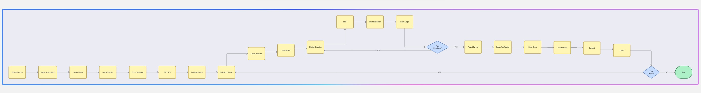

# 🎮 QUIZZY App

A vibrant, modern general knowledge quiz built with React, Vite, and JavaScript. This project focuses on clean code, Service Pattern architecture, and separation of concerns.

🌐 **Live Demo**: [quizzy on Vercel](https://quizz-martine.vercel.app)  
📋 **Project Board**: [View Trello Board](https://trello.com/b/zxegXEBf)



---

## 👤 User Stories

- **Core Gameplay**: As a player, I want to choose a theme and difficulty level to test my knowledge.
- **Progression (Auth)**: As a competitor, I want to log in to accumulate points and unlock progressive badges (Novice to GOAT).
- **Immersion**: As a user, I want a dynamic audio and visual atmosphere (music, glitch effects) for an immersive gaming experience.
- **Inclusion (Accessibility)**: As a dyslexic user, I want to activate an adapted reading mode to comfortably read questions.

---

## ✨ Key Features

- **Service Layer Architecture**: Complete decoupling of API logic from UI components.
- **User Authentication**: Secure registration/login system with Strapi Auth + welcome popup on registration.
- **Internal Routing**: Custom state-based navigation (Game, Contact, Legal) without page reloads.
- **Inclusive Design**: Specialized Dyslexic Mode toggle for enhanced accessibility.
- **Gamification**: Dynamic badge system (Novice to GOAT) based on total accumulated points.
- **Persistent Leaderboard**: Real-time "Hall of Fame" fetching Top 5 scores.
- **Real-time Feedback**: Asynchronous contact form via Axios.
- **Audio Immersive System**: Background music & SFX with a Global Mute Toggle (persistent state).
- **Dynamic UI**: Glitch & Pulse animations for high-engagement Call to Action buttons.
- **PWA Ready**: Installable as a Progressive Web App via `vite-plugin-pwa`.

---

## ⚖️ Navigation & Compliance

- **GDPR Ready**: Dedicated pages for Terms of Use (CGU), Legal Mentions, and GDPR policy.
- **Advanced Validation**: Regex-based form checks for data integrity.
- **WCAG Compliant**: Full keyboard navigation (TAB/ENTER) and semantic HTML5.

---

## 🚀 Tech Stack

| Layer | Technology |
|-------|-----------|
| Frontend | React 19 + Vite 7 |
| Backend | Strapi 5 (Headless CMS) |
| Hosting (Frontend) | Vercel |
| Hosting (Backend) | Strapi Cloud |
| Styling | CSS3 (Variables, Flexbox, Grid, Animations) |
| Libraries | canvas-confetti, axios, vite-plugin-pwa |

---

## 🛠️ Architecture & Logic

### 📁 Service Pattern
Technical logic is isolated in `src/services/api.js`. UI components remain "dumb" and focus only on rendering, making the app highly scalable.

### ⚡ Performance & Safety
- **Cascading Renders Fix**: Optimized `useEffect` hooks with asynchronous wrappers.
- **Memory Safety**: Systematic use of `useCallback` and cleanup functions to prevent leaks.
- **PWA Optimization**: Manifest configuration matching real asset sizes for a seamless installation experience.

---

## 🧠 Game Logic

- **Dynamic Timer**: CSS variables synchronized with React state for smooth hardware-accelerated progress bars.
- **Shuffle Algorithm**: Real-time randomization via a custom Strapi endpoint (`/api/questions/random`) for a unique experience every session.
- **Audio Logic**: Audio managed via `useRef` (Single-instance) to maintain persistent Mute state without interruption during state changes.
- **Label Syncing**: Centralized dictionary pattern to decouple database IDs from display labels (e.g., `monde` → `Aléatoire`).

---

## ⚙️ Installation & Setup (Local Development)

### Prerequisites
- Node.js v24+
- npm

### 1. Clone the repository
```bash
git clone https://github.com/Martine9670/quizz.git
cd quizz
```

### 2. Frontend setup
```bash
cd frontend
npm install
```

Create a `.env` file in the `frontend` folder:
```env
VITE_API_URL=http://localhost:1337/api
```

Start the frontend:
```bash
npm run dev
```

### 3. Backend setup (Strapi)
```bash
cd ../backend
npm install
```

Create a `.env` file in the `backend` folder:
```env
HOST=0.0.0.0
PORT=1337
APP_KEYS=your_app_keys
API_TOKEN_SALT=your_salt
ADMIN_JWT_SECRET=your_secret
TRANSFER_TOKEN_SALT=your_salt
JWT_SECRET=your_secret
```

Start the backend:
```bash
npm run develop
```

Strapi runs on `http://localhost:1337`.

### 4. Strapi Permissions
In `http://localhost:1337/admin` → **Settings → Users & Permissions → Roles**:

**Public role:**
- Question → `find`, `findOne`, `random`
- Score → `find`, `findOne`

**Authenticated role:**
- Score → `find`, `findOne`, `create`
- Message → `create`

---

## 🔄 Data Management

- **Database**: 4500+ questions managed via the Strapi Admin panel.
- **Export**: Use the provided `export_questions.js` script to export questions from a local Strapi instance.
- **Seeding (Example)**: A template script `import_questions.example.js` is provided to test your local installation:

```bash
node import_questions.example.js
```

---

## 👩‍💻 Author

**Martine PINNA**