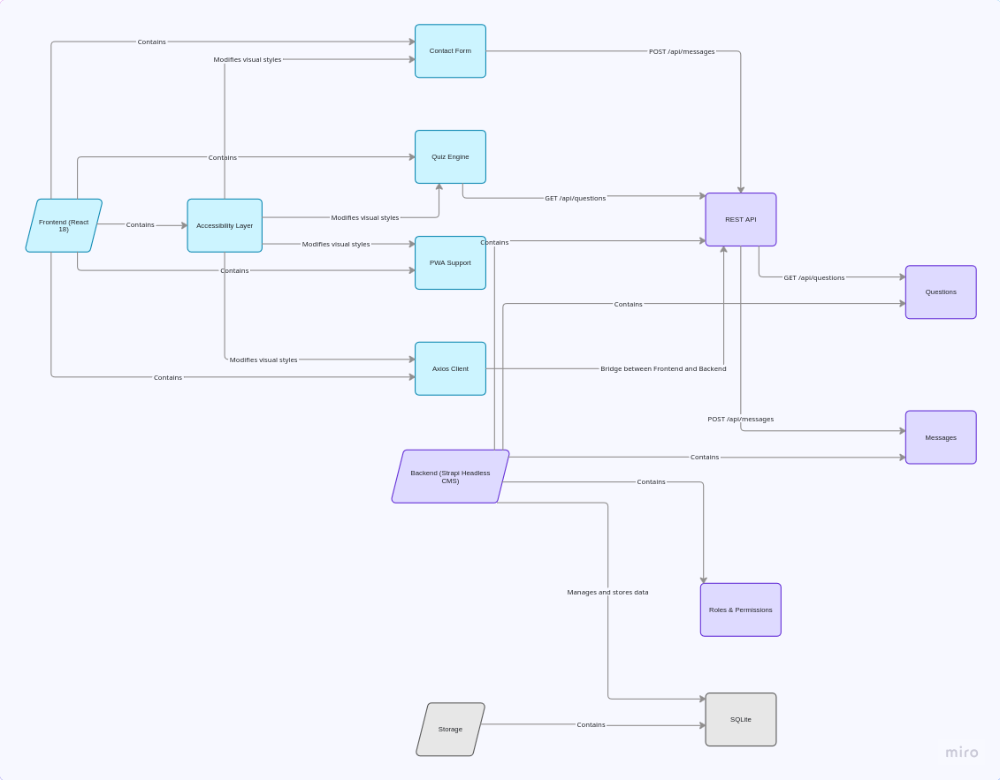

🎮 QUIZZY App

A vibrant, modern general knowledge quiz built with React, Vite, and JavaScript. This project focuses on clean code, Service Pattern architecture, and separation of concerns.

👤 User Stories
Core Gameplay (CRUD): En tant que joueur, je veux choisir un niveau de difficulté et répondre à des questions, afin de tester mes connaissances et voir mon score.

Progression (Auth): En tant que compétiteur, je veux m'identifier pour que mes points soient cumulés et obtenir des badges (Novice à GOAT) montrant mon évolution.

Mobilité (PWA): En tant qu'utilisateur mobile, je veux installer l'application sur mon écran d'accueil afin d'y accéder rapidement partout.

Inclusion (Accessibilité): En tant qu'utilisateur dyslexique, je veux activer un mode de lecture adapté afin de lire les questions confortablement.

✨ Key Features
Service Layer Architecture: Complete decoupling of API logic from UI components.

User Authentication: Secure registration/login system with Strapi Auth.

Internal Routing: Custom state-based navigation (Game, Contact, Legal) without reloads.

Inclusive Design: Specialized Dyslexic Mode toggle for enhanced accessibility.

Gamification: Dynamic badge system (Novice, Apprenti, Guerrier, Expert, Légende, GOAT) based on total points.

Persistent Leaderboard: Real-time "Hall of Fame" fetching Top 5 scores.

Real-time Feedback: Asynchronous contact form via Axios.

⚖️ Navigation & Compliance
GDPR Ready: Dedicated pages for Terms of Use (CGU) and Legal Mentions.

Advanced Validation: Regex-based form checks for data integrity.

WCAG Compliant: Full keyboard navigation (TAB/ENTER) and semantic HTML5.

🚀 Tech Stack
Frontend: React (Advanced Hooks: useState, useEffect, useCallback)

Backend: Strapi CMS (Headless)

Styling: CSS3 (Variables, Flexbox, Transitions)

Library: canvas-confetti, vite-plugin-pwa

🛠️ Architecture & Logic
📁 The Service Pattern
Technical logic is isolated in src/services/api.js. UI components remain "dumb" and focus only on rendering, making the app highly scalable.

⚡ Performance & Safety
Cascading Renders Fix: Optimized useEffect hooks with asynchronous wrappers.

Memory Safety: Systematic use of useCallback and cleanup functions to prevent leaks.

PWA Optimization: Manifest configuration matching real asset sizes for a seamless installation experience.

🧠 Game Logic
Dynamic Timer: CSS variables synced with React state for smooth progress bars.

Shuffle Algorithm: Real-time randomization of questions.
⚙️ Installation & Setup
1. Clone & Install
Bash

git clone <your-repository-url>
cd quizz

# Install Frontend
cd frontend && npm install

# Install Backend
cd ../backend && npm install

2. Backend Setup (Strapi)

    Ensure Strapi runs on http://localhost:1337.

    Permissions: Enable find (Questions/Scores), create (Scores/Messages), and Auth in Settings > Roles > Public.

🔄 Data Import (Optional)

If the database is empty:

    Start Strapi (npm run develop).

    Open a terminal at the root of the project.

    Run: node import_questions.js

📁 Project Management

Development followed an Agile methodology. Track progress and tasks here:
👉 [View Trello Board] https://trello.com/b/zxegXEBf

---

Author: Martine PINNA